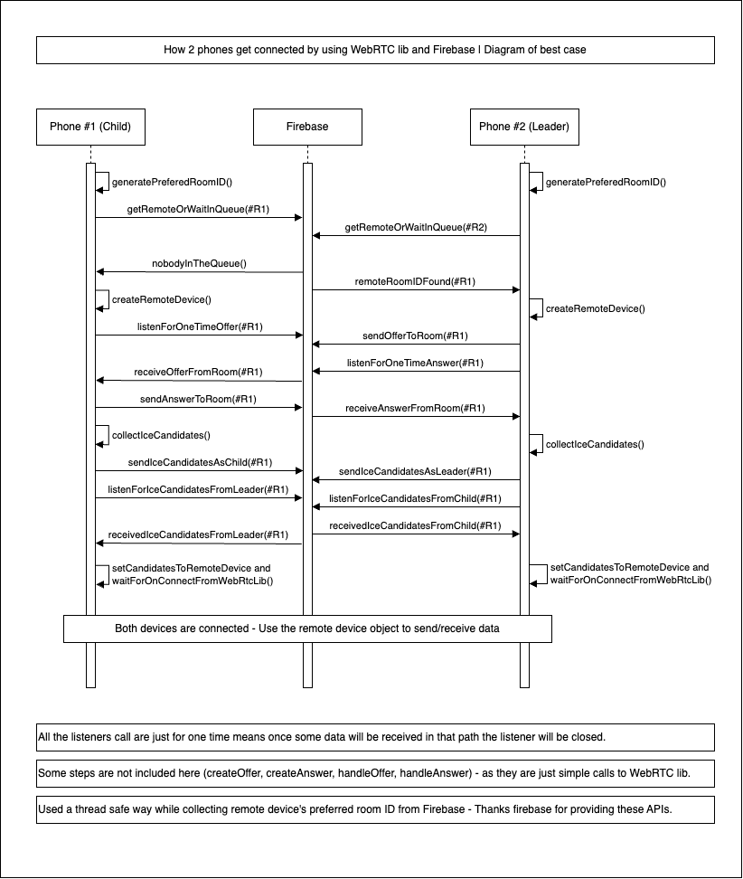
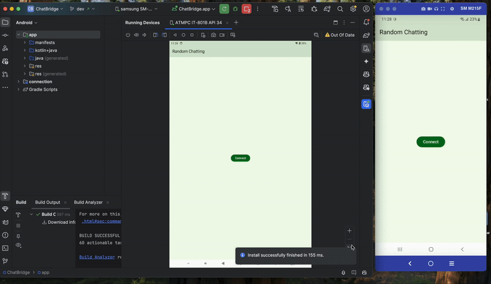

# MatchMakingTest
MatchMakingTest

## Overview
A library for native android developer to connect two Android phone by using WebRTC library and Firebase. All the connection-related codes are moduled separately in the 'connection' module. 
   
A simple chat application for demo purpose, was made by using the connection module.

## Features
- Connect two phones using WebRTC
- Firebase as the signaling server
- Modular connection-related code
- Chat application as demo

## Basic flow of how connection module works

## Connection module class diagram
will be uploaded soon

## Chat application setup
1. Clone the repository.
2. Open the project in Android Studio.
3. Connect your project with Firebase
4. Paste 'google-services.json' file under app folder
5. Build and run the project on two different devices.
6. Start chating instantly

## Chat application demo
